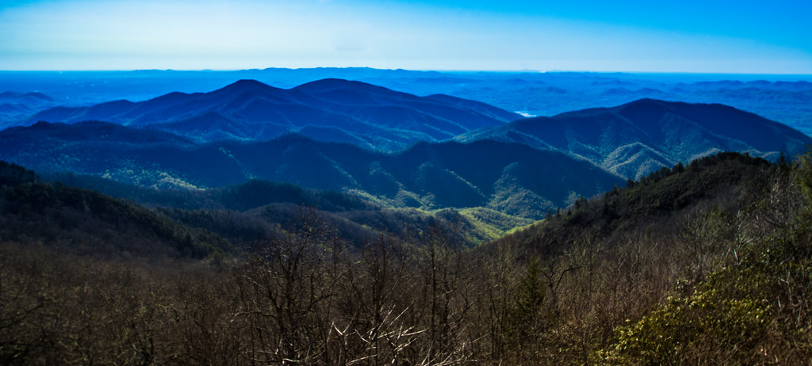
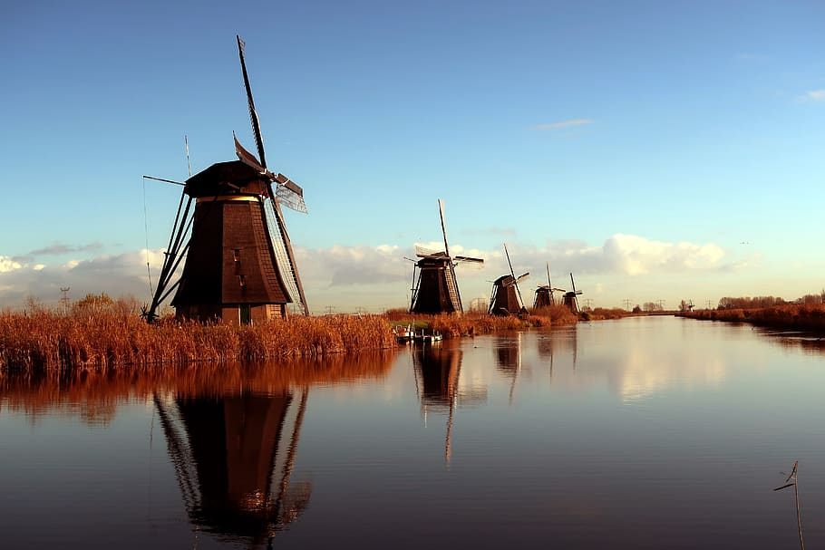

```{r setup, include=FALSE}
knitr::opts_chunk$set(echo = TRUE)
knitr::opts_chunk$set(cache=TRUE)
```

## Introduction

Hello, Biostat 776! Welcome to my web-page. Please click on the "About" tab to read more about me.

## Interesting link

While you are here, check out this neat page that you can use to learn another language. It is free and has lots of practice activities. I used this sight a lot to help me learn French.

[Conjuguemos](https://conjuguemos.com/)


*Google Creative Commons*



*Google Creative Commons*


